# Android Recipes App

**Android Recipes App** is a recipe cookbook mobile application for Android platform that is ready to use on both phones and tablets. 
Just fill your recipes, choose one of the many color themes and you are ready to publish your application in Google Play.
The application is fully native, using latest features of Android platform to provide the best user experience.
The recipes are bundled with the application and can be used without internet connection.
The application is specially optimized to be extremely easy to configure and detailed documentation is provided.

## Requirements

* Windows XP (32-bit), Vista (32- or 64-bit), or Windows 7 (32- or 64-bit)
* Mac OS X 10.5.8 or later (x86 only)
* Linux (tested on Ubuntu Linux, Lucid Lynx)
  * GNU C Library (glibc) 2.7 or later is required.
  * On Ubuntu Linux, version 8.04 or later is required.
  * 64-bit distributions must be capable of running 32-bit applications.
* Latest [ADT Bundle](http://developer.android.com/sdk/index.html)


# Getting started

Thank you for buying **Android Recipes App**. To try the template you need to follow a few simple steps:

1. [Import projects in ADT Bundle](#import-projects-in-adt-bundle)
2. [Run any theme project](#run-android-recipes-app-on-a-device-or-on-android-emulator)

If you are upgrading from previous version, check the [upgrading guide](#upgrading-from-previous-version).

## Import projects in ADT Bundle

The application is configured to be build with latest [ADT Bundle](http://developer.android.com/sdk/index.html), so you need to install it before proceeding.

1. [Launch ADT Bundle](http://developer.android.com/sdk/installing/bundle.html).
1. Select from the menu `File`->`Import`->`General`->`Existing Projects into Workspace`
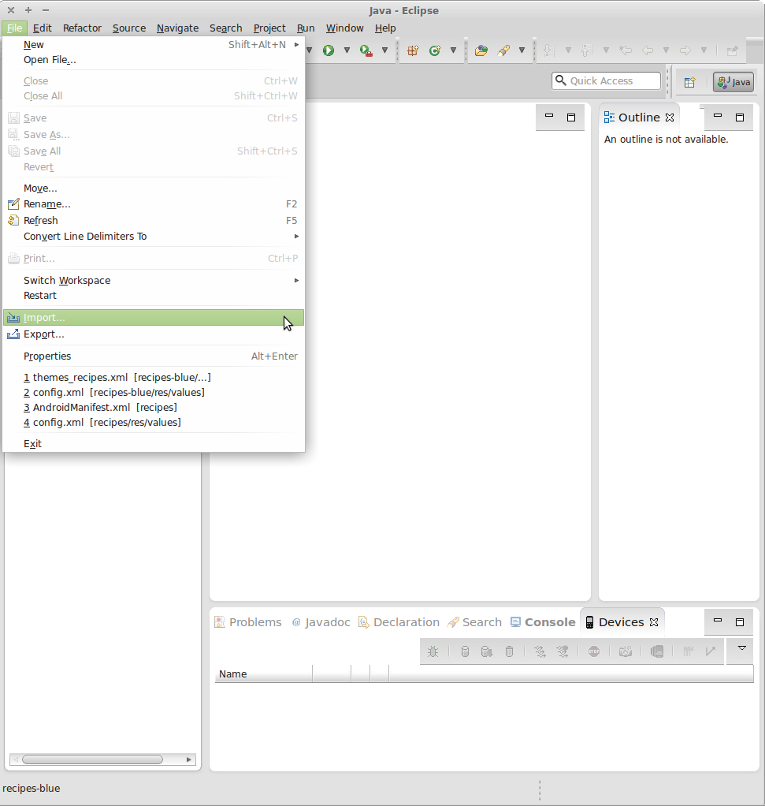
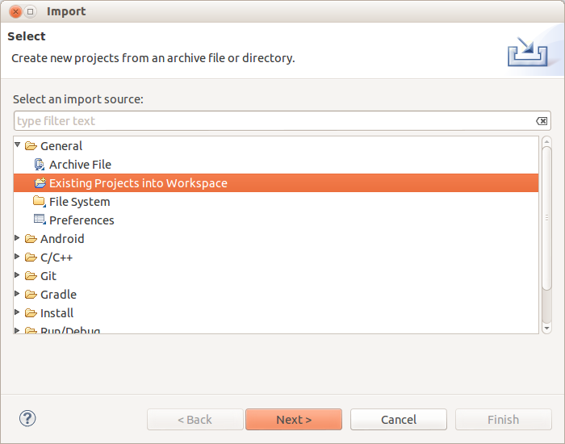
1. Browse to the location where you extracted the **Android Recipes App**
1. Beside the **Projects:** list press `Select All`
1. Press `Finish`
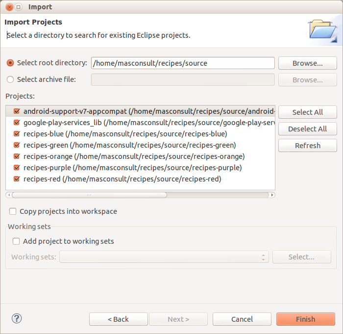
1. You should wait until ADT Bundle builds the projects and then you can [run](#run-android-recipes-app-on-a-device-or-on-android-emulator) any of `recipes-*` projects to explore the different themes.

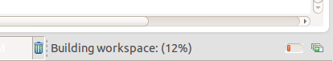

**Note:** If you get errors, try by cleaning all projects:
1. from the menu `Projects`->`Clean`
2. select all projects and press `OK`.

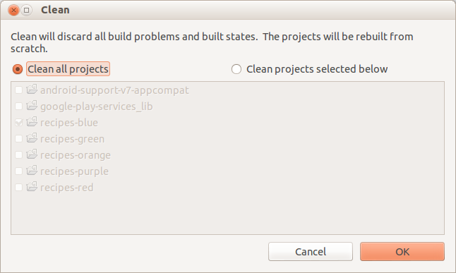

## Run Android recipes app on a device or on Android emulator

Bellow are described the steps for running the application on Android emulator or on real device

1. Right click on the project you want to run `Run As`->`1 Android Application`
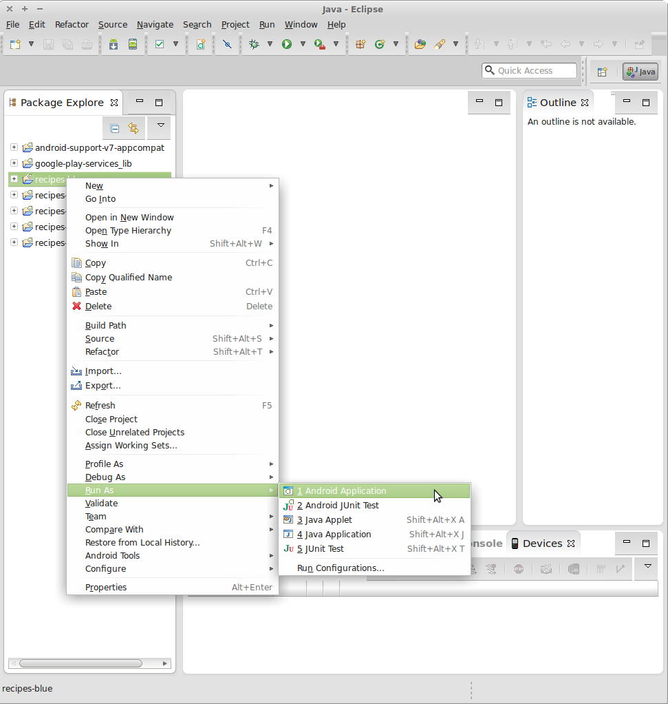
1. Choose on what device or emulator to run the app.(If you haven't connected any devices or started any emulator, ADT Bundle will try to start most appropriate Android emulator and run the application on it).
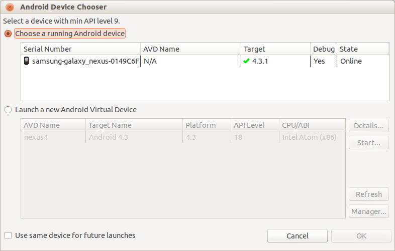


# Customization

In the following lines I'll describe how to customize **Android Recipes App** to match your brand and needs.

After you buy **Android Recipes App** you need to:

1. [Import projects in ADT Bundle](#import-projects-in-adt-bundle)
1. [Choose your color theme](#choose-your-color-theme)
1. [Add some data(Build json file with recipes and add recipes images)](#add-some-data-to-the-application)
1. [Choose what indices to display in list and detailed page](#set-up-recipe-indices)
1. [Change Launcher icon](#change-launcher-icon)
1. [Change Splash screen icon](#change-splash-screen-icon)
1. [Change Application name](#change-application-name)
1. [Set up notifications](#set-up-system-notifications)
1. [Set up Ads](#set-up-ads)
1. [Set up Google Analytics](#set-up-google-analytics)
1. [Translate in different language](#translate-in-different-language)

**Note:** You need to [run the project](#run-android-recipes-app-on-a-device-or-on-android-emulator) after making changes, to see them in the application!

## Choose your color theme

We provide **Android Recipes App** with 5 different color themes separated in 5 android projects. 
You should choose one of these themes and make all the configurations and customizations in the project representing
the color you have choosen. If you wish to see how the colors look like in the app you can [run any one of theme projects on a Device or on a Emulator](#run-android-recipes-app-on-a-device-or-on-android-emulator)

### Red theme
Project name: **recipes-red**

| Splash | List |
| ------ | ---- |
| 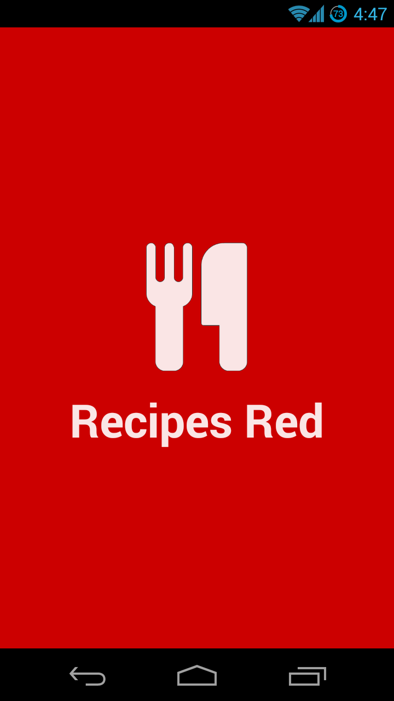 | 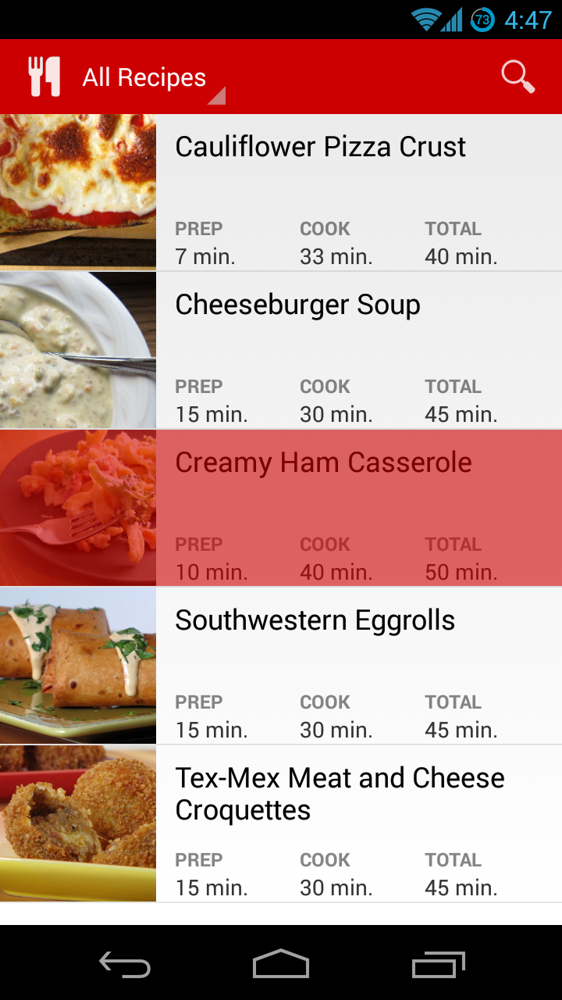 |

### Green theme
Project name: **recipes-green**

| Splash | List |
| ------ | ---- |
| 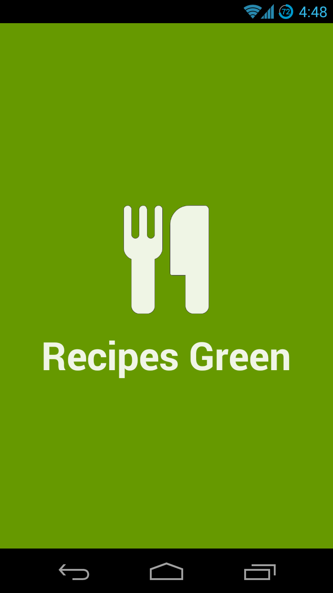 | 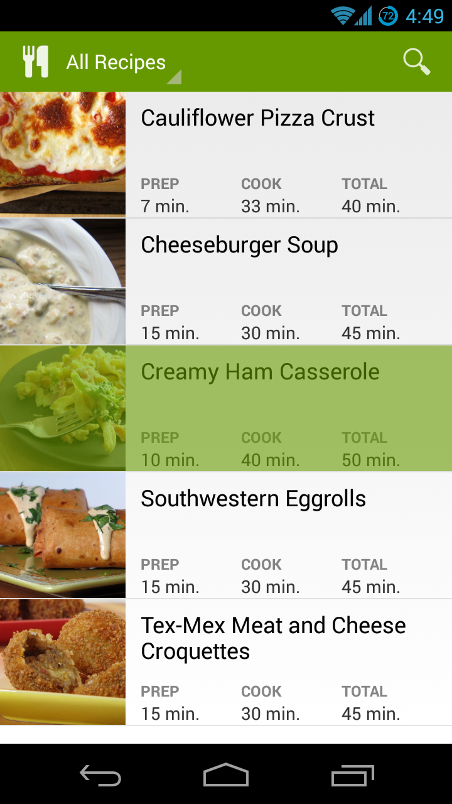 |

### Blue theme
Project name: **recipes-blue**

| Splash | List |
| ------ | ---- |
| 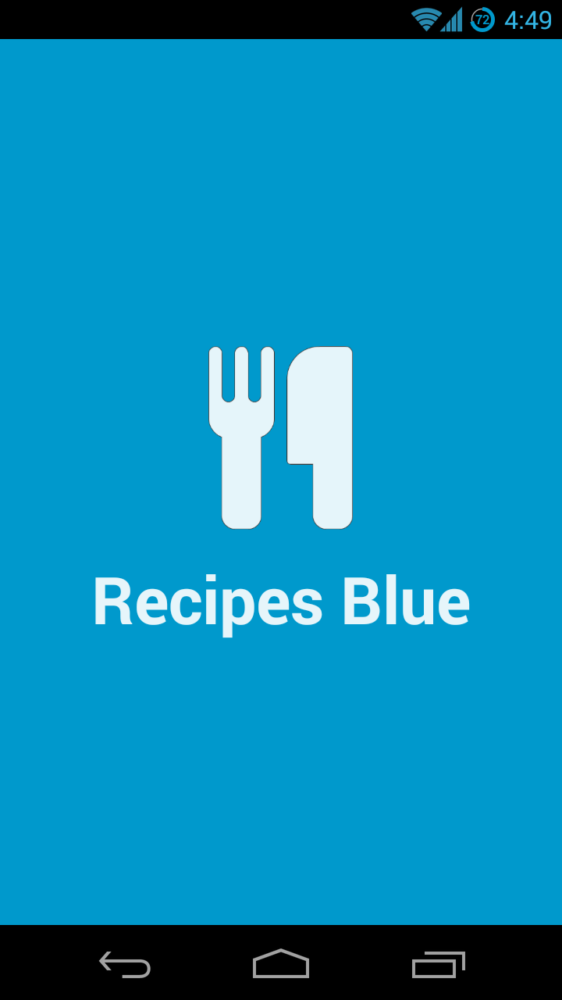 | 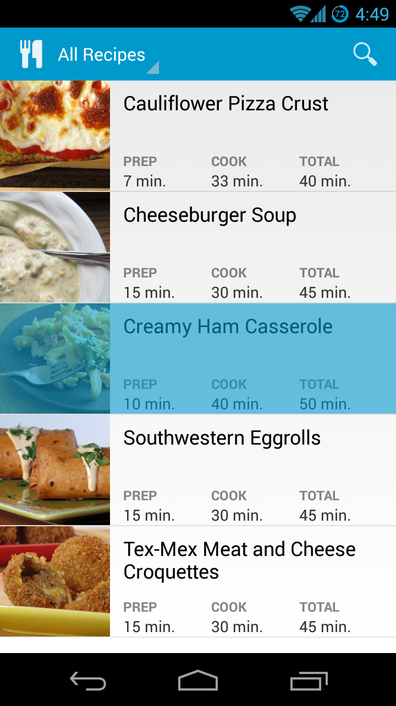 |

### Purple theme
Project name: **recipes-purple**

| Splash | List |
| ------ | ---- |
| 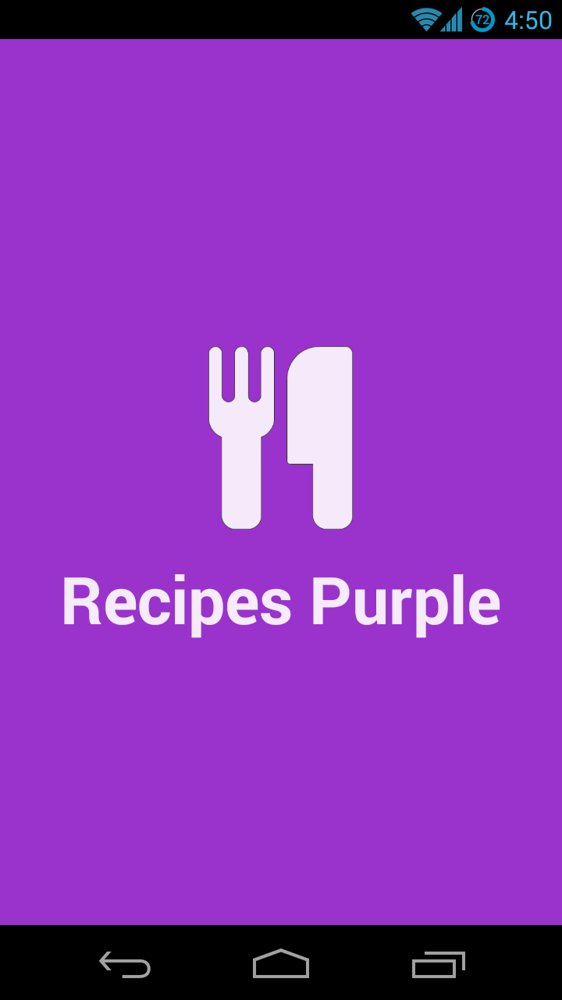 | 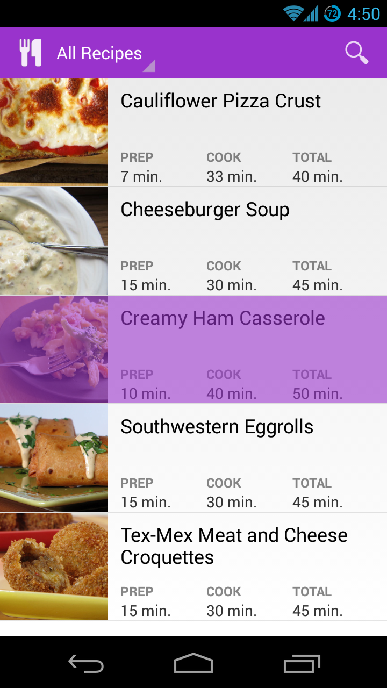 |

### Orange theme
Project name: **recipes-orange**

| Splash | List |
| ------ | ---- |
| 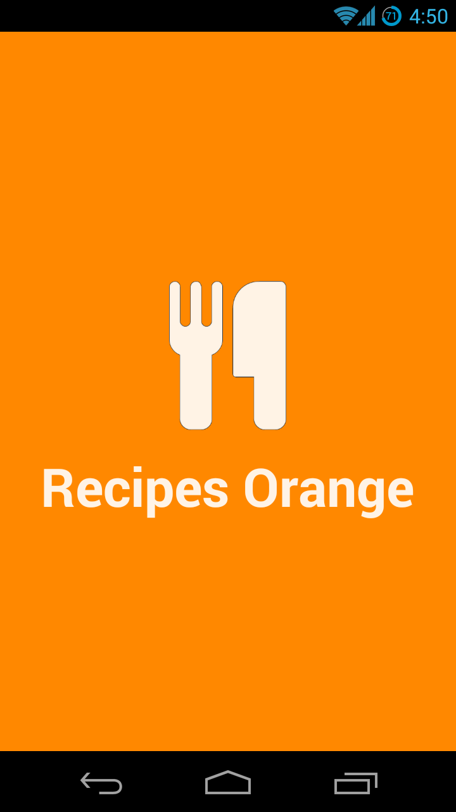 | 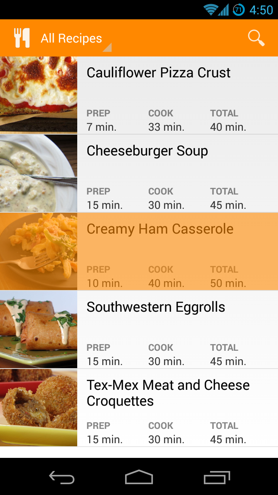 |

## Add some data to the application

Recipes are loaded when application starts and imported inside a local database. While the application is running it displays data from the local database, so even without internet connection the recipes will be browsable.

### Configuring source of recipes data

The configuration is located inside `res/values/config.xml`. If you want to load recipes from remote location you need to specify the full URL:

```
    <!-- res/values/config.xml -->
    <!-- when url is specified the recipes are loaded from that location -->
    <string name="recipes_url">http://s3.amazonaws.com/masconsult-template-recipes/recipes.json</string>
```

When you don't need to load recipes from remote location, but rather ship with preloaded list, just clear the configuration and recipes will be loaded from local `assets/recipes.json` file.

```
    <!-- res/values/config.xml -->
    <!-- when no url is specified the recipes are loaded from assets/recipes.json file -->
    <string name="recipes_url"></string>
```

### Recipes data format

The recipes data uses [JSON](http://www.json.org/) format. Bundled with each project is a sample file `assets/recipes.json` with populated data which can help you understand the structure.

```json
{
    "recipes": [
        {
            "id": "recipe1",
            "category": "dinner",
            "name": "Beef",
            "image": "beef.jpg",
            "summary": "Beef dinner",
            "direction": "1. Take one beef\n 2. Slice\n 3. Spice\n 4. Cook\n 5. Serve with wine",
            "prep_time": 7,
            "cook_time": 45,
            "total_time": 55,
            "serves": 1,
            "ingredients": [
                "1kg of fresh beef meat",
                "1 bottle of fine red wine"
            ]
        }
    ]
}

```

Each recipe is surrounded by `{` and `}` (opening and closing curly brackets). Inside you have a series of `name`:`value` with the following meaning:

* `id`: is an optional identificator for recipe, when ommited the combination of category and name is used to check for duplicating recipes. If you are using only local file, you can safely ignore this field.
* `category`: is the category of the recipe, you may enter whatever category you decide, just bear in mind that this is the name visible in the categories list inside the application
* `name`: is the name of recipe as seen in the application
* `image`: the name of the image to use for this recipe. Images are located inside `images` directory and may be divided in subdirectories - in which case you need to enter the subdirectory name followed by `/` (forward slash)
* `summary`: a short summary presenting the result of the recipe
* `directions`: the full directions needed to follow the recipe
* `prep_time`: is the time in minutes needed to prepare the recipe.
* `cook_time`: is the time in minutes needed to cook the recipe.
* `total_time`: is the total time in minutes needed to cook the recipe. If this number is omitted but `prep_time` and/or `cook_time` is present it will be automatically calculated.
* `serves`: the number of serving for the given ingredients quantities.
* `ingredients`: is a comma-separated list (defined using square brackets `[` and `]`) of strings, each one surrounded by `"` (double quotes). E.g.:
```json
  "ingredients": ["flour", "salt", "water"]
```

**Warning:** If you need to add a quote `"` inside the strings you need to escape it like this `\"`

**Note:** If you want to add new line in the `summary` or `directions` fields use `\n`. E.g. 
```json
    [{ "summary": "Great appetizer.\nRecommended with spices" }]
```

To verify the file is syntactically correct you can copy/paste it to [JSONLint](http://pro.jsonlint.com/)

### Recipes update

When using local `assets/recipes.json` file to load recipes, they are loaded only when the application is first run, or when application have been updated.
When using remote recipes url, every time the application is started the url is retrieved and recipes are loaded. To minimize the traffic, you can use the [extended format](#remote-recipes-optimization) for remote recipes and specify url that will only return new recipes.

## Set up recipe indices

You can set up what indices to display in the recipes list and recipe detail screens.
Supported indices are:
* Preparation time
* Cooking time
* Total time
* Servings

You can enable/disable each one of indices from `res/values/config.xml`.

### Display preparation time

Controls whether to display preparation time for each recipe. If you do not support preparation time, disable by setting `false`.

| List | Recipe |
| ---- | ------ |
| 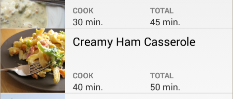 | 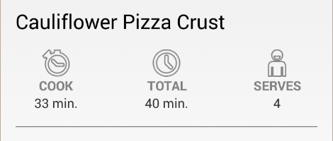 |

```xml
  <!-- res/values/config.xml -->
  <bool name="show_prep_time">true</bool>
```

### Display cooking time

Controls whether to display cooking time for each recipe. If you do not support cooking time, disable by setting `false`.

| List | Recipe |
| ---- | ------ |
|  | 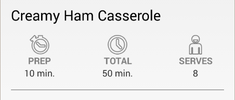 |

```xml
  <!-- res/values/config.xml -->
  <bool name="show_cook_time">true</bool>
```

### Display total time

Controls whether to display total time for each recipe. If you do not supply total time in your data it is calculated by summing `prep_time` and `cook_time`.
If you do not want to display preparation time, disable by setting `false`.

| List | Recipe |
| ---- | ------ |
|  |  |

```xml
  <!-- res/values/config.xml -->
  <bool name="show_total_time">true</bool>
```

### Display servings

Controls the display of servings. If you do not want to display serving, disable it by setting to `false`.

| List | Recipe |
| ---- | ------ |
| 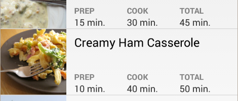 | 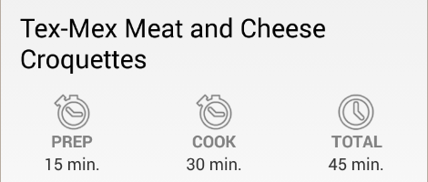 |

```xml
  <!-- res/values/config.xml -->
  <bool name="show_servings">true</bool>
```

## Change Launcher icon

For best result you should have your icon designed in 512x512 pixels resolution. Then replace the following files:

* `res/drawable-mdpi/ic_launcher.png` with 48x48 px
* `res/drawable-hdpi/ic_launcher.png` with 72x72 px
* `res/drawable-xhdpi/ic_launcher.png` with 96x96 px
* `res/drawable-xxhdpi/ic_launcher.png` with 144x144 px
* `res/drawable-xxxhdpi/ic_launcher.png` with 192x192 px

**Note:** You need the 512x512 px size for publishing to Google Play.

## Change Splash screen icon
 
The splash screen uses by default themed background and larger version of the launcher icon centered in the middle. If you just want to change the icon you should replace the file
`res/drawable-xxhdpi/logo.png` with one about 300x300 pixels.

If you want to make more modifications the layout for splash screen is located at `res/layout/activity_splash.xml`.

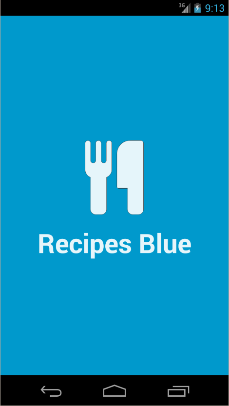

## Change Application name

The application name is stored inside `res/values/strings.xml` as:

```xml
    <!-- res/values/strings.xml -->
    <string name="app_name">Recipes</string>
```
Just change to whatever your application will be called.

## Set up system notifications

By default every day a notification will be presented featuring one recipe. When user clicks on the notification it will open the application on that recipe.
The notifications don't include sound, vibrator or led indicator. You can modify the interval(in hours) or if you put zero the notifications will be disabled:

| Closed notification | Large notification |
| ---- | ------ |
|  | 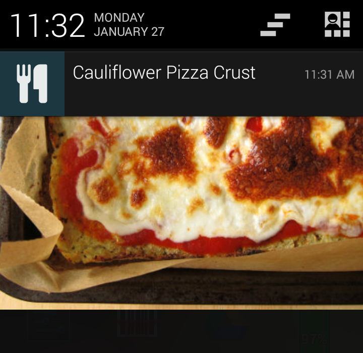 |


```xml
  <!-- res/values/config.xml -->
  <integer name="notifications_interval">22</integer>
```

## Set up Ads

| With ads | Without ads |
| ---- | ------ |
|  | 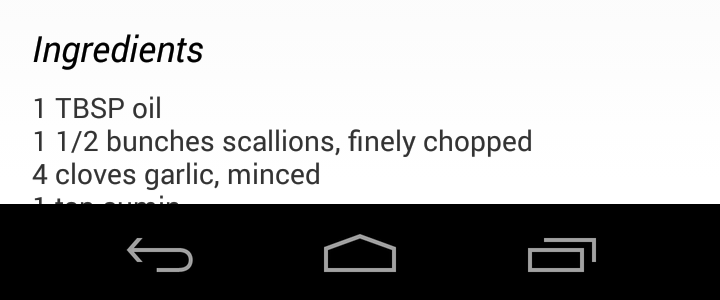 |

The template comes with integrated [AdMob](https://apps.admob.com/). To enable it you need to enter your AdMob unit id.

1. Open `res/values/config.xml`
2. Locate **admob_unit_id**
3. Enter your AdMob unit ID

```xml
  <!-- res/values/config.xml -->
  <string name="admob_unit_id">{YOUR ADMOB UNIT ID GOES HERE}</string>
```

To find your AdMob unit ID, login to [AdMob](https://apps.admob.com/) click the `Monetize` tab. Click `All apps` from the left-hand side and select an app. The ad unit ID is under the ad unit name. 
For more information refer to [AdMob Help](https://support.google.com/admob/v2/answer/3016009).

If you leave the entry empty ads will not be displayed.

## Set up Google Analytics

To enable [Google Analytics](http://www.google.com/analytics/) you need to enter your Google Analytics tracking ID. If you want to disable analytcis just leave the entry empty.

1. Open `res/values/config.xml`
2. Locate **ga_trackingId**
3. Enter your [Google Analytics tracking ID](http://support.google.com/analytics/answer/2614741)

```xml
  <!-- res/values/config.xml -->
  <string name="ga_trackingId">{YOUR TRACKING ID GOES HERE}</string>
```

## Translate in different language

All the texts used in the template are contained in a single file `/res/values/strings.xml`. To translate the  template change all values in the file with appropriate translation. 


# Remote Recipes Optimization

## Splitting data in smaller chunks

When retrieving recipes over network it is good practice to split large files in smaller chunks. This allows for partial display of data 
as well as handle network connection change. To tell the application that you are serving only a part of the whole data, add a field `next_page` with 
absolute URL where the next part is located. You can repeat this process as long as needed. Good rule of thumb is to split data in sizes of about 50-60kb, 
which should translate in about 25 recipes.

```json
    {
        "recipes": [{...}, {...}],
        "next_page": "http://s3.amazonaws.com/masconsult-template-recipes/recipes-page2.json",
    }
```
**Note:** the `recipes` array is ommitted for clarity!

**Warning:** you need to provide absolute url for `next_page` field.

## Loading only new data

Having downloading all recipes every time the application starts may lead to excess data usage and unhappy users. To optimize the transfer of
only new data, add a field `next_update` with absolute URL which will be used the next time recipes are updated. Good rule of thumb is to include
the timestamp when the current update is happening, so you can return only data that is newer than this timestamp next time.

```json
    {
        "recipes": [{...}, {...}],
        "next_update": "http://s3.amazonaws.com/masconsult-template-recipes/recipes-update.json",
    }
```
**Note:** the `recipes` array is ommitted for clarity!

**Warning:** you need to provide absolute url for `next_update` field.


# Upgrading from previous version

## Upgrading from 1.0

1. Copy over the content of `recipes-<color>` folder contained in the package you downloaded over your project, without `assets` folder and `res/values/config.xml`.
2. Edit `config.xml` and add to the bottom just before the final `</resources>` line:

    ```xml
        <!-- URL where the recipes are located. Application will load only remote recipes if URL is present or load recipes from local assets/recipes.json file if entry is empty -->
        <!--
        uncomment to test with remote recipes
        <string name="recipes_url" translatable="false">http://s3.amazonaws.com/masconsult-template-recipes/recipes.json</string>
        -->
        <!-- when empty recipes are loaded from local assets/recipes.json file -->
        <string name="recipes_url" translatable="false"></string>
    ```

3. Edit your `assets/recipes.json` file and add at the very beggining before the first `[`:

    ```json
    {
      "recipes":
    ```

4. Edit your `assets/recipes.json` file and add at the very end after the final `]`:

    ```json
    }
    ```

5. Make sure your `assets/recipes.json` file looks like this:

    ```json
    {
      "recipes": [
        {
          ... ommitted for clarity
        },
        {
          ... ommitted for clarity
        }
      ]
    }
    ```

6. Make sure everything works, by **removing** and **installing** the application on device or emulator.


# Prepare for publishing

Before publishing the application to Google Play, make sure you have done:

2. [Changed the launcher icon](#change-launcher-icon) in `res/drawable-*/ic_launcher.png`
2. [Changed the splash icon](#change-splash-screen-icon) in `res/drawable-*/ic_launcher.png`
1. [Changed the application name](#change-application-name) in `res/values/strings.xml`
3. [Added recipes](#add-some-data-to-the-application) in `recipes.json`
1. [Changed the package name](#changing-package-name) in `AndroidManifest.xml`
4. [Changed content provider authorities](#changing-content-provider-authorities) to match your package name in `res/values/config.xml`

## Changing package name

Every application in Google Play has an unique application name usually in the form `com.example.app`. Before you can publish your application you need to change the
application name to something unique (like use your domain as prefix in reverse order). To change it, you need to:

1. Run ADT and open the project
2. Right click on the project
3. From the popup menu select `Android Tools`->`Rename Application Package`
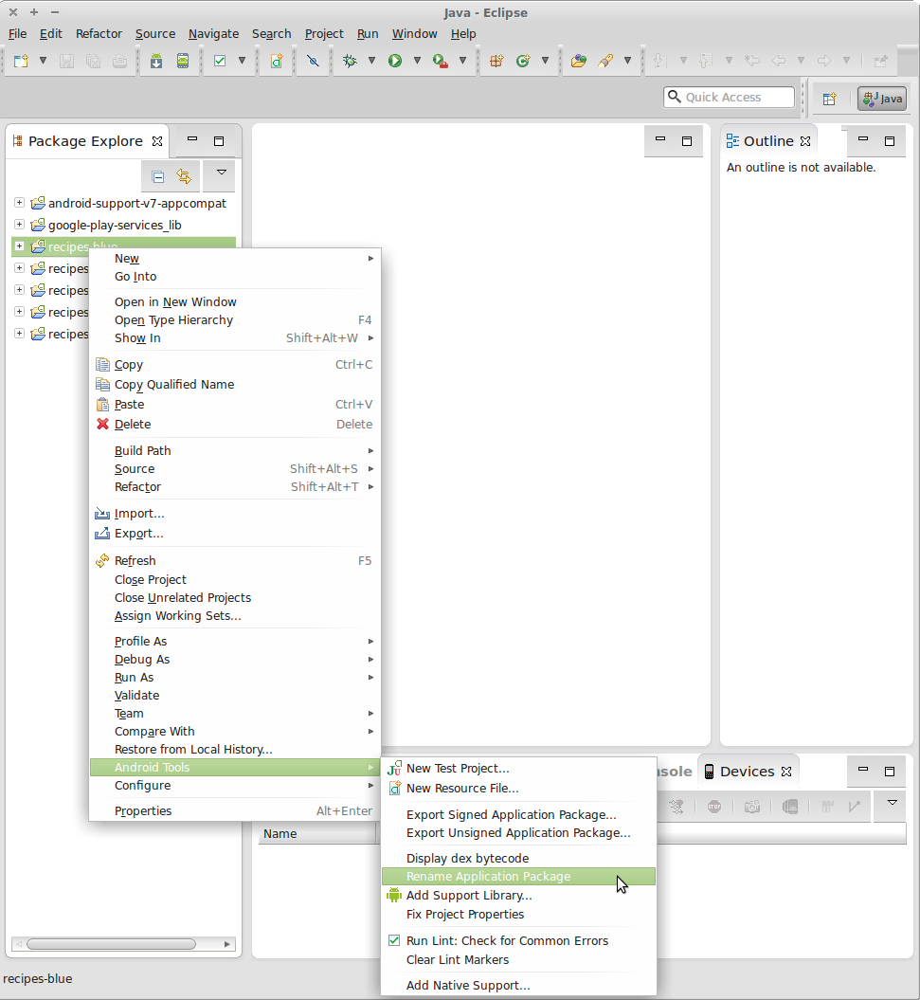
4. Enter your new package name and press `OK`

5. Press `Finish`
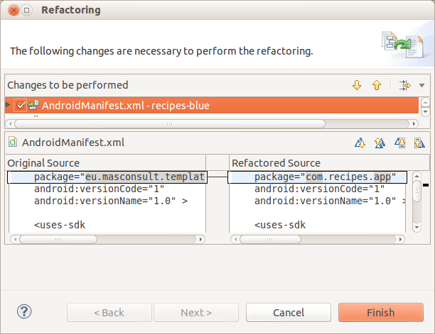

That's it.

## Changing content provider authorities

In android, data are stored in a special container called **ContentProvider**. Each content provider needs to have an unique identifier, that is usually derived from
the package name with some suffix. Before you publish your application you need to change these unique identifiers called authorities.

1. Open the file `res/values/config.xml`
2. Locate the lines for `search_suggestions_authority` and `recipes_content_authority`:
```xml
    <string name="search_suggestions_authority">eu.masconsult.template.recipes.content.SearchRecipeSuggestionsProvider</string>
    <string name="recipes_content_authority">eu.masconsult.template.recipes.content.recipesdb</string>
```
3. Replace the text **eu.masconsult.template.recipes** with what you put as your [package name](##changing-package-name).
4. Save and run your application
5. Try to browse and search for recipies to verify everything is working.


# Misc

## Rating & Suggestions
If you like our app, we will highly appreciate if you can provide us a rating of 5.

We would love to get suggestions from you. Tell us in comment section what other features you want to see with this app. We will try to add more features into it.

## Credits

All images and recipes in the demo are for demonstrative purposes only and are not available for use by buyers.

+ [The Keenan Cookbook](http://thekeenancookbook.com)
+ [Cooking Ventures](http://cookingventures.blogspot.com)

Icons are generated from:
+ [Font Awesome](http://fortawesome.github.com/Font-Awesome)
+ [Web Symbols](http://www.justbenicestudio.com)
+ [Entypo](http://www.entypo.com)
+ [Typicons](http://typicons.com)
+ [MFG Labs](http://www.mfglabs.com)
+ [Maki](http://mapbox.com/maki)
+ [Elusive](http://aristeides.com)
+ [Linecons](http://designmodo.com/linecons-free)

The following libraries are distributed and used:
+ [Mechanoid](https://github.com/robotoworks/mechanoid) version 0.2.2: [Apache 2](http://www.apache.org/licenses/LICENSE-2.0) license
+ [Universal Image Loader for Android](https://github.com/nostra13/Android-Universal-Image-Loader) version 1.9.1: [Apache 2](http://www.apache.org/licenses/LICENSE-2.0) license
+ [CWAC MergeAdapter](https://github.com/commonsguy/cwac-merge) version 1.0.1: [Apache 2](http://www.apache.org/licenses/LICENSE-2.0) license
+ [CWAC SackOfViewsAdapter](https://github.com/commonsguy/cwac-sacklist) version 1.0.0: [Apache 2](http://www.apache.org/licenses/LICENSE-2.0) license
+ [Google Analytics Android SDK](https://developers.google.com/analytics/devguides/collection/android/) version 3.01: Copyright 2013 Google, Inc. All rights reserved.
+ [Google Play Services SDK](https://developer.android.com/google/play-services/index.html) revision 14: Copyright 2013 Google, Inc. All rights reserved.
+ [Android Support Library v7 appcompat](http://developer.android.com/tools/support-library/features.html#v7-appcompat) revision 19.0.1: [Apache 2](http://www.apache.org/licenses/LICENSE-2.0) license

Once again, thank you so much for purchasing this theme. 
As I said at the beginning, I would be glad to help you if you have any questions relating to this theme. 
No guarantees, but I will do my best to help. 


